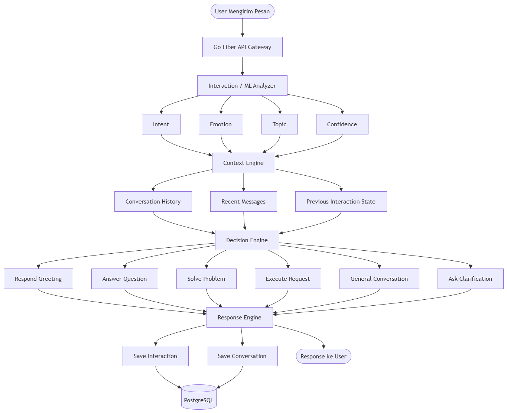
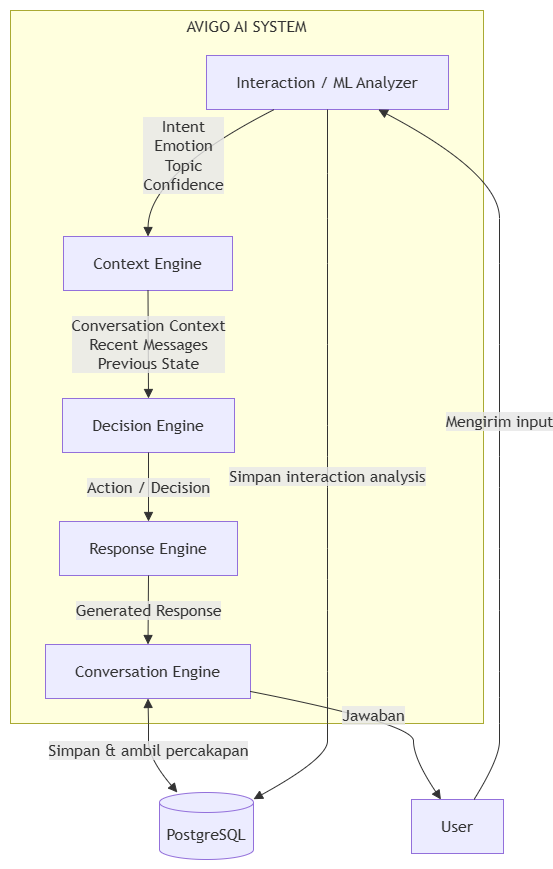

# AVIGO AI System

Dokumentasi arsitektur dan alur kerja sistem AI AVIGO.

AVIGO dirancang dengan beberapa komponen utama yang bekerja secara berurutan untuk memahami input pengguna, menentukan tindakan, menghasilkan respons, dan menyimpan riwayat percakapan.

## System Flow

Diagram berikut menunjukkan alur utama interaksi pengguna dengan sistem AVIGO.

### Alur Sistem

User
↓
Go Fiber API Gateway
↓
Interaction / ML Analyzer
↓
Context Engine
↓
Decision Engine
↓
Response Engine
↓
Conversation Engine
↓
User

### Komponen

- Go Fiber API Gateway — menerima request dari pengguna.
- Interaction / ML Analyzer — menganalisis intent, emotion, topic, dan confidence.
- Context Engine — memahami konteks percakapan dan riwayat pesan.
- Decision Engine — menentukan tindakan yang harus dilakukan AVIGO.
- Response Engine — menghasilkan respons berdasarkan keputusan.
- Conversation Engine — mengelola percakapan dan riwayat interaksi.
- PostgreSQL — menyimpan data interaksi dan percakapan.

## Use Case

Diagram berikut menunjukkan use case utama pada sistem AVIGO AI.

### Interaction / ML Analyzer

Menganalisis input pengguna untuk mendapatkan:

- Intent
- Emotion
- Topic
- Confidence

### Context Engine

Menggunakan informasi percakapan:

- Conversation History
- Recent Messages
- Previous Interaction State

### Decision Engine

Menentukan tindakan berdasarkan hasil analisis dan konteks:

- Respond Greeting
- Answer Question
- Solve Problem
- Execute Request
- General Conversation
- Ask Clarification

### Response Engine

Menghasilkan respons sesuai dengan action yang telah ditentukan.

### Conversation Engine

Mengelola penyimpanan dan pengambilan data percakapan.

### PostgreSQL

Menyimpan data interaction analysis dan conversation history.

## Architecture Overview

Pipeline utama AVIGO:

User
↓
Go Fiber Gateway
↓
Interaction / ML
↓
Context
↓
Decision
↓
Response
↓
Conversation
↓
PostgreSQL

## Project Status

- [x] Interaction / ML Analyzer
- [x] Context Engine
- [x] Decision Engine
- [ ] Response Engine
- [ ] Conversation Orchestrator
- [ ] End-to-End Conversation
